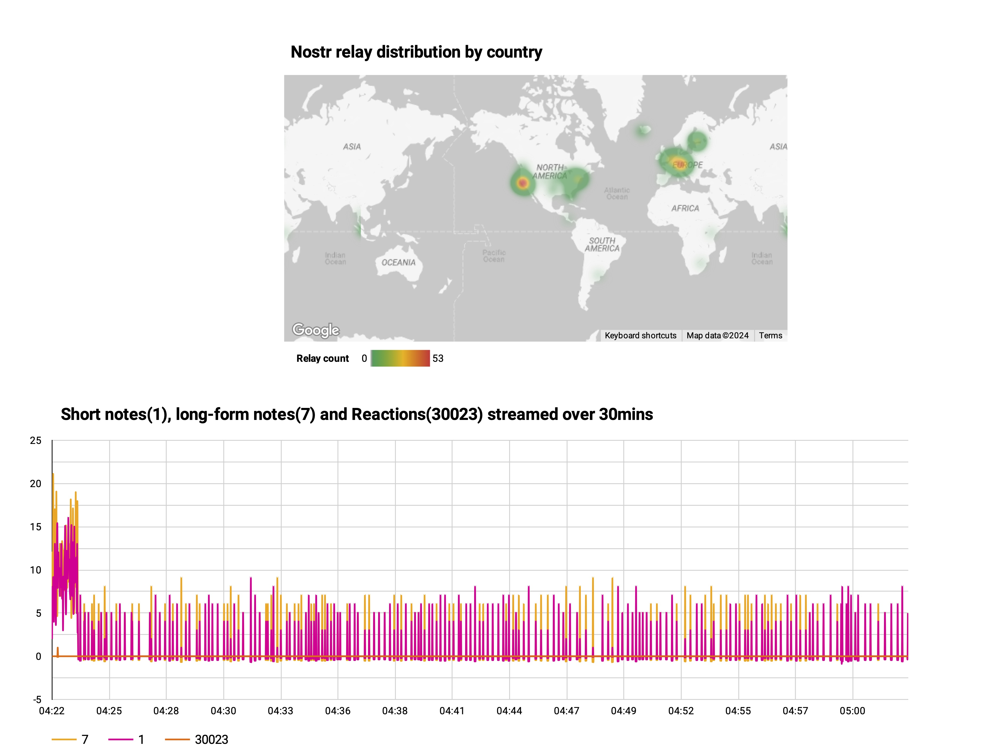

# Decentralised Social Networks

Analytics/NLP engine for decentralised social networks.

## Problem statement
Data on Decentralised social networks is sharded and distributed across multiple nodes. Unlike blockchains there is no single source of truth. Decentralised analytics aims to provide a robust, architecture that facilitates analytics for decentralised networks such as Nostr and Farcaster.

## Supported Networks
- [Nostr](https://nostr.com/)
- [Farcaster](https://docs.farcaster.xyz/)

## Tech Stack
- Python Engine
  - Data wrangling logic (Requesting prescribed [events](src/nostr/event.py) from [relays](src/nostr/relay.py))
  - Data pipelines/workflows implemented in [Prefect](orchestration/prefect/)
    - [Producer](src/kafka/producer.py) (retrieving events from relays via websockets)
    - [Consumer](src/kafka/consumer.py) (persisting events to BigQuery)
- Prefect for Orchestration
- Apache Kafka for data streaming
- BigQuery for Data Warehousing
- DBT for data modelling
- [Looker Studio](https://lookerstudio.google.com) for dashboards
  - Number of active relays distributed on a geographic map
  - Real-time dashboard of events of kinds 1,7 and 30023  [kinds](https://nostrdata.github.io/kinds/)



## Installation
1. Clone this repo!

2. Create free tier accounts for the following:
- [BigQuery/GCP](https://cloud.google.com/bigquery?hl=en)
- [Upstash(Kafka)](https://upstash.com/)
- [IP Geolocation](https://ipgeolocation.io/documentation.html)

3. Generate GCP key that has admin rights to BigQuery and set [default credentials](https://cloud.google.com/docs/authentication/provide-credentials-adc)

4. Install [Terraform](https://developer.hashicorp.com/terraform/install) and [dbt](https://docs.getdbt.com/docs/core/pip-install


5. Configure the [.env.prd](./.env.prd) with api keys, etc..

### Terraform (Create BigQuery tables)
```
cd infrastructure/terraform/ && terraform apply
```

Run commands:

Nostr Events producer:
```
docker compose -f docker-compose.yml up producer_events
```

Nostr Events consumer:
```
docker compose -f docker-compose.yml up consumer_events
```

Nostr Relays producer:
```
docker compose -f docker-compose.yml up produce_relays
```

Nostr Relays consumer:
```
docker compose -f docker-compose.yml up process_relays
```

Run DBT Transformation for dashboards after producers/consumers are running:
```
cd transformation/ && dbt run
```

## Tests
```
pdm install
```
```
cd tests && pytest
```

## Architecture

## Future considerations
- Installation / deployment needs streamlining.
- Remove dependency on IP Geolocation service. Import data into BigQuery from free resources.
- Prefect Orchestration could be refactored without Click and retain similar functionality.
- More tests
- Better dashboards
- NLP analytics on content

## Acknowledgements
Thanks to [@jessthibault](https://github.com/jeffthibault) author of [python-nostr](https://github.com/jeffthibault/python-nostr) where the Nostr [base models](src/nostr/) were largely taken from and modified.
