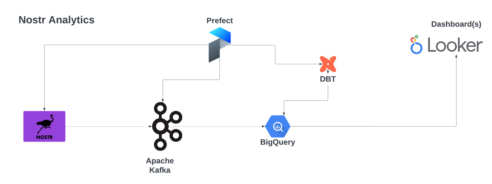

# Decentralised Social Networks

Analytics/NLP engine for decentralised social networks.

## Problem statement
Data on Decentralised social networks is sharded and distributed across multiple nodes. Unlike blockchains there is no single source of truth. Decentralised analytics aims to provide a robust, architecture that allows for accurate analytics from decentralised networks such as Nostr and Farcaster.

## Supported Networks
- [Nostr](https://nostr.com/)
- [Farcaster] — TBD

## Tech Stack
- Python Engine
  - Data wrangling logic (Requesting prescribed [events](src/nostr/relay.py) from relays)
  - Data pipelines/workflows implemented in Prefect
    - [Producer](src/kafka/producer.py) (retrieving events from [relays] via websockets)
    - [Consumer](src/kafka/consumer.py) (persisting events to BigQuery)
- Prefect for Orchestration
- Apache Kafka for data streaming
- BigQuery for Data Warehousing
- DBT for data modelling
- [MetaBase](https://www.metabase.com/) for dashboards
  - Number of active relays displayed on a geographic map
  - Number of daily events and their [kinds](https://nostrdata.github.io/kinds/)

## Deployment
1. Create free tier accounts on the following:
- [BigQuery/GCP](https://cloud.google.com/bigquery?hl=en)
- [Upstash(Kafka)](https://upstash.com/)
- [IP Geolocation](https://ipgeolocation.io/documentation.html)

2. Configure the [.env.prd](./.env.prd) with your keys

3. Run commands:

```
$ docker run -it vmatekole/nostr-analytics bash
```
## Architecture

## Future considerations
-

## Usage

## Acknowledgements
Thanks to [@jessthibault](https://github.com/jeffthibault) author of [python-nostr](https://github.com/jeffthibault/python-nostr) where the Nostr [base models](src/nostr/) were largely taken from and modified.
